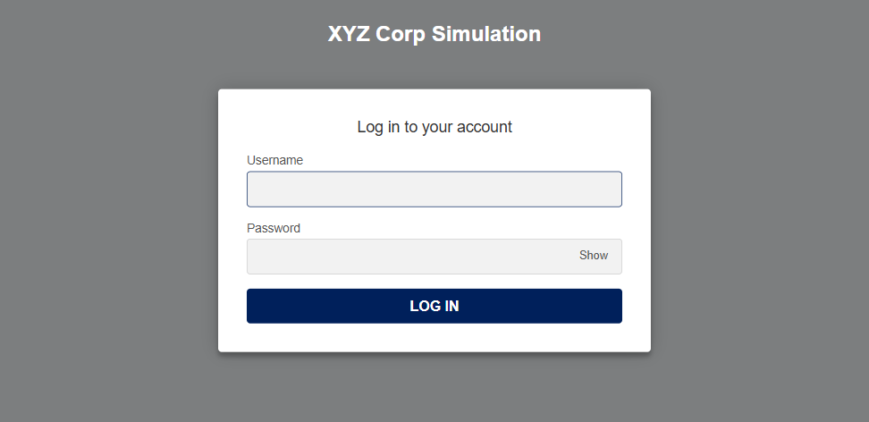
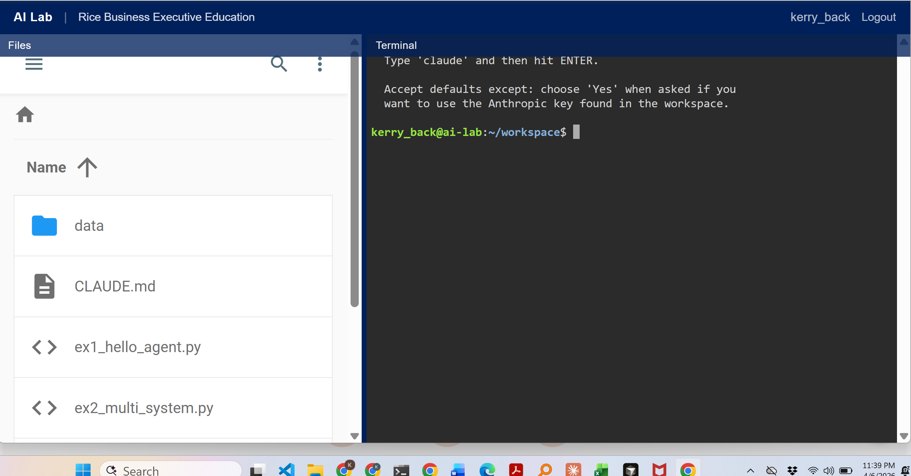

## Welcome {.section-divider}

::: {.notes}
Welcome to From BI to AI: Making Data-Driven Decisions with Agentic AI. I am Kerry Back, a professor of finance at Rice University.

In this short video, I want to give you a preview of what we will cover over our four weeks together and introduce the two tools you will be using throughout the course.
:::

---

## What This Course Is About

::: {.highlight-box}
AI agents that understand plain English can now generate charts, query databases, write reports, build predictive models, and assemble complete deliverables --- all from a single prompt.
:::

This course teaches you to use these tools for:

- **Personal productivity** --- charts, documents, analyses, automated workflows
- **Enterprise data** --- querying databases, merging cross-system data, extracting information from documents
- **Organizational strategy** --- deployment decisions, governance, and AI adoption planning

::: {.notes}
This course is about a specific capability that has emerged in the past year: AI agents that can write and execute code on your behalf. You describe what you want in plain English, and the agent produces it --- a chart, a financial analysis, an executive summary, a dashboard.

This is not about becoming a programmer. It is about learning to direct AI effectively and verify its output --- including learning when AI gets it wrong and how to catch it.

The course uses Anthropic's Claude as its primary AI tool. The skills you learn transfer to other AI platforms, but the exercises and environments are built on Claude.

We start with personal productivity, move to enterprise data, cover deployment and governance, and finish with predictive modeling and strategy.
:::

---

## The Course Arc {.shrink}

::: {.step-flow}
::: {.step-card}
::: {.step-icon}
💬
:::
::: {.step-title}
Sessions 1--2
:::
::: {.step-desc}
Personal Productivity
:::
:::
::: {.step-card}
::: {.step-icon}
🗄️
:::
::: {.step-title}
Sessions 3--4
:::
::: {.step-desc}
Enterprise Data
:::
:::
::: {.step-card}
::: {.step-icon}
🏗️
:::
::: {.step-title}
Sessions 5--6
:::
::: {.step-desc}
Deployment & Governance
:::
:::
::: {.step-card}
::: {.step-icon}
🔮
:::
::: {.step-title}
Sessions 7--8
:::
::: {.step-desc}
Prediction & Strategy
:::
:::
:::

::: {.explainer}
Eight sessions over four weeks. Two sessions per week. Each session is 90 minutes and includes a mix of instruction, live demos, hands-on exercises, and group discussion.
:::

::: {.notes}
Here is the structure. The course moves from you to your organization.

Sessions one and two focus on personal productivity --- charts, documents, spreadsheets, interactive calculators. You will learn how to iterate on AI output and verify it using what we call the maker/checker framework.

Sessions three and four shift to enterprise data --- querying databases, merging cross-system results, and producing executive reports.

Sessions five and six cover the hard questions: where does the AI run, how do you secure the data, and how do you catch errors before they reach a decision-maker.

Sessions seven and eight cover predictive modeling and culminate in a capstone where you present an AI adoption strategy for your organization.

Expect roughly two to three hours of preparation per week outside of class, including pre-readings, homework exercises, and work on your capstone strategy.
:::

---

## Sessions 1--2: Personal Productivity

::: {.two-cards}
::: {.card .card-light}
[What You Will Do]{.card-title}

- Generate charts, documents, and spreadsheets from plain-English prompts
- Build interactive tools --- calculators, dashboards, data visualizations
- Create reusable prompt templates for recurring workflows
- Iterate on AI output until it meets your standards
:::
::: {.card .card-dark}
[Key Concept: Maker/Checker]{.card-title}

- AI is the **maker** --- fast, tireless, format-flexible
- You are the **checker** --- domain knowledge, judgment, accountability
- The skill shift: from producing analysis to **directing and verifying** it
- Verification effort scales with stakes
:::
:::

::: {.notes}
In the first two sessions, you will use AI to do real work. Not toy examples --- actual deliverables you could send to a colleague or present to your team. You will generate Excel workbooks, Word documents, PowerPoint slides, and interactive charts. The key concept we introduce is the maker/checker framework. The AI drafts; you verify. This is not a new idea --- it is quality assurance --- but the specific failure modes of AI are new. The AI is confident even when wrong. It never says "I'm not sure." Learning to verify effectively is the core skill of this course.
:::

---

## Sessions 3--4: Enterprise Data

::: {.highlight-box}
A CEO asks: "Which of our customers buy from multiple divisions?" Today, that question takes **three weeks** and involves six people across four departments. With the XYZ Corp Custom Chatbot, a first draft takes **30 seconds** --- though verifying the answer still matters.
:::

::: {.two-cards}
::: {.card .card-light}
[What the Chatbot Does]{.card-title}

- Answers general business questions in plain English
- Writes SQL queries against 9 enterprise databases
- Searches a RAG database of corporate documents (contracts, policies, manuals)
- Merges data across systems and produces deliverables
:::
::: {.card .card-dark}
[What You Will Learn]{.card-title}

- How AI agents query structured data (databases)
- How AI looks up and reasons over documents (contracts, policies, manuals)
- How to evaluate cross-system results
- What data preparation is required before deployment
:::
:::

::: {.notes}
In sessions three and four, we move from personal productivity to enterprise data. You will use the XYZ Corp Custom Chatbot --- a custom AI chatbot that connects to multiple enterprise systems, answers general business questions, and searches a RAG database of corporate documents. It answers business questions by writing database queries, retrieving information from documents, merging results across systems, and producing complete deliverables.

I will show you a live demo where a single English prompt produces a cross-system customer analysis that would normally take weeks. You will then do this yourself. The demo works because the data environment has been set up in advance --- we will also discuss what that setup involves.

We also cover document-based AI --- extracting information from contracts, policy manuals, and other unstructured documents, and combining it with database queries. By the end of session four, you will have produced a complete executive report from enterprise data.
:::

---

## Sessions 5--6: Deployment and Governance

::: {.three-cards}
::: {.card .card-light}
[Deployment]{.card-title}

- Cloud API vs. on-premise vs. hybrid
- Cost, security, and compliance tradeoffs
- Build vs. buy evaluation framework
:::
::: {.card .card-light}
[Trust]{.card-title}

- Three failure modes that look like successes
- The checker's verification checklist
- Red-teaming exercises to break the agent
:::
::: {.card .card-light}
[Governance]{.card-title}

- Access control and audit trails
- Regulatory requirements (SOX, GDPR, HIPAA)
- Approval chains for AI-generated output
:::
:::

::: {.notes}
Sessions five and six address the questions your IT department and compliance team will ask. Where does the AI run? What data does it see? Who approves the output?

Session five covers three deployment architectures --- cloud API, on-premise, and a hybrid approach where the AI generates queries but never sees raw data.

Session six is about trust. I will show you three specific examples where AI agents produce plausible-looking answers that are wrong --- wrong filters, wrong date parsing, double-counted customers. You will learn a structured checklist for catching these errors, and you will red-team the agent yourself, trying to make it fail.

We also cover governance: who can query what data, what gets logged, and how to meet regulatory requirements.
:::

---

## Sessions 7--8: Prediction and Strategy

::: {.two-cards}
::: {.card .card-light}
[Predictive Modeling]{.card-title}

- Use AI to build machine learning models from plain-English prompts
- Classification (will this customer churn?) and regression (what will revenue be?)
- Evaluate models: confusion matrices, precision/recall, feature importance
- Understand when to trust --- and when to distrust --- model predictions
:::
::: {.card .card-dark}
[Capstone]{.card-title}

- Present a scoped AI adoption strategy for your organization
- Specify use cases, deployment approach, governance plan
- Define a 90-day pilot with concrete success metrics
- Use AI as a thinking partner for strategic decisions
:::
:::

::: {.notes}
Session seven introduces predictive modeling. You will use AI to build a machine learning model --- not by writing code, but by describing the problem in English and letting the AI handle the technical details. You will learn to evaluate whether the model's predictions are trustworthy using the same maker/checker framework from earlier sessions.

Session eight is the capstone. You will present an AI adoption strategy for your organization to your peers, covering the use case, deployment approach, governance plan, and a concrete 90-day pilot. Volunteers present to the full class for feedback.

We also demonstrate using AI as a strategic thinking partner --- not just asking "what happened?" but "what should we do?" and pushing back on the answer.
:::

---

## The XYZ Corp Custom Chatbot {.image-slide}

### Your Enterprise AI Environment

{width=60%}

::: {.explainer}
A custom chatbot for a simulated $500M B2B distributor with 3 divisions, 9 enterprise systems, and a RAG database of corporate documents. Ask questions in plain English --- the chatbot answers general questions, writes SQL, merges data, searches documents, and produces deliverables.
:::

::: {.notes}
Let me introduce the two tools you will use throughout the course. The first is the XYZ Corp Custom Chatbot. This is a custom AI chatbot built for a fictional enterprise. XYZ Corp is a $500 million B2B industrial supplies distributor with three operating divisions --- Industrial, Energy, and Safety. Each division has its own CRM, and the company runs shared finance, HR, and support systems --- nine enterprise systems in total, with 41 database tables and over 26,000 rows of realistic data spanning three years. The chatbot also has access to a RAG database of corporate documents --- contracts, policies, and manuals. You log in through your browser, type a question in plain English, and the chatbot answers general questions, writes SQL queries against the databases, searches the document collection, merges results across systems, and produces charts, tables, and narrative summaries. This is where you will do your enterprise data work in sessions three through six.

<!-- NOTE FOR RECORDING: Replace the login page screenshot with a screenshot showing a completed query with results — for example, the cross-system customer analysis or the Q4 executive summary. -->
:::

---

## The AI+Code Lab {.image-slide}

### Your Personal AI Coding Environment

{width=60%}

::: {.explainer}
Each participant gets a personal workspace with Claude Code, Anthropic's AI coding tool. Build charts, dashboards, predictive models, and automated workflows. No software installation required.
:::

::: {.notes}
The second tool is the AI+Code Lab. This gives each of you a personal workspace in the cloud with access to Claude Code, Anthropic's AI coding tool. Through the lab, you can build charts, interactive dashboards, predictive models, and automated workflows --- all from plain-English instructions.

You do not need to install any software on your own computer. Everything runs in your browser. We use the AI+Code Lab primarily in sessions one, two, four, and seven --- whenever you are building something hands-on.

<!-- NOTE FOR RECORDING: Replace the login page screenshot with a screenshot showing the Claude Code terminal interface with a completed task — for example, a chart or dashboard being generated. -->
:::

---

## What You Will Leave With

- Hands-on experience with enterprise AI tools across all eight sessions
- A portfolio of deliverables you produced yourself --- charts, reports, dashboards, predictive models
- A concrete AI adoption strategy for your organization with a 90-day pilot plan
- The ability to identify when AI output is wrong and how to catch errors before they reach a decision-maker

::: {.highlight-box}
The goal is not to make you a programmer. It is to make you effective at **directing AI**, **verifying its output**, and **evaluating AI adoption** for your organization.
:::

::: {.notes}
Let me be clear about what this course will and will not do. It will not make you a programmer. It will make you effective at directing AI to do analytical work, verifying the results, and evaluating AI adoption for your organization.

You will leave with hands-on experience using two enterprise AI tools, a portfolio of deliverables you produced yourself, and a concrete strategy document you can take back to your team.

The XYZ Corp Custom Chatbot remains available for 90 days after the course ends. Claude Code requires a separate subscription for continued use after the course, but the free tier at claude.ai is available to everyone.

Every session includes live demos, hands-on exercises, and group discussion. This is not a lecture course --- you will be working with AI from the first session.
:::

---

## Before Session 1

::: {.info-box}
[To prepare]{.box-title}

- **Create a free account** at [claude.ai](https://claude.ai) (no credit card required) --- you will use this in Session 1
- **Think about your data** --- what recurring reports, analyses, or deliverables do you produce regularly?
- **Identify one question** that currently requires data from multiple systems to answer
- We will send you login credentials for the XYZ Corp Custom Chatbot and the AI+Code Lab before Session 3
:::

::: {.explainer}
No programming background is required. Familiarity with spreadsheets and basic data concepts is helpful.
:::

::: {.notes}
To prepare for the first session, please create a free account at claude.ai --- no credit card required. You will use this from the very first exercise.

I also want you to think about the analytical work you do regularly --- the reports, analyses, and deliverables that take up your time. And think about one question at your company that currently requires pulling data from multiple systems to answer. We will use these examples throughout the course. The hands-on exercises use simulated company data, not your own company's data, so there are no confidentiality concerns.

No programming background is required. Familiarity with spreadsheets and basic data concepts is helpful, but if you can describe what you want in English, you have the skills you need. I look forward to working with you.
:::
